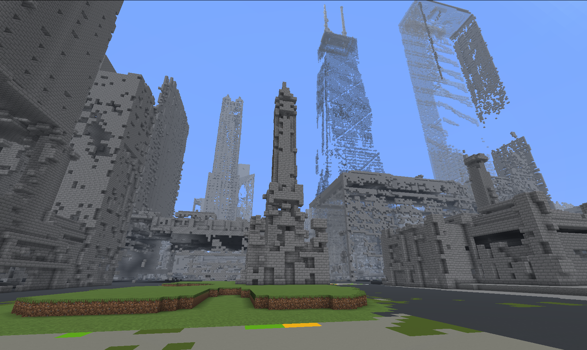

# Earthcraft

Earthcraft turns a bounded real-world place into a Minecraft Java world. The
project keeps the geographic measurements, source provenance, and uncertainty
visible instead of hiding them behind a screenshot that merely looks right.



*An early Water Tower build from September 10, 2026. This is a screenshot of
the project running, not a claim that every block in the frame is accurate.*

The public baseline is deterministic and does not require AI. It works from
local, frozen inputs and uses ordinary geometry, source data, and Minecraft
world files. There are separate experiments for local computer vision, but
they are optional, disabled by default, and cannot invent missing geography.

This is still an experimental project. A small 64 × 64 block Water Tower test
and larger Chicago experiments exist, but game loading and real-world accuracy
are not accepted as finished until they are checked independently. The current
roadmap is in [docs/PLAN.md](docs/PLAN.md); the evidence and release limits are
in [docs/PUBLIC_RELEASE.md](docs/PUBLIC_RELEASE.md).

The whole-Earth direction is sparse and on demand, not a claim that every
square metre has already been generated. See
[docs/GLOBAL_GENERATION.md](docs/GLOBAL_GENERATION.md) for the scrape stages,
parallel tile workers, precise-surface/repeated-substrate split, and the
privacy-safe progress contract behind the dashboard.

## Why not just use Arnis?

pros:

- Turning geographic data into a playable Minecraft world without needing
  Earthcraft's larger evidence pipeline.
- Providing a straightforward baseline for checking scale, coordinates,
  terrain, and game-version behaviour.
- Being the better choice if the goal is simply to generate a place and start
  walking around.

cons:

- Source provenance and uncertainty: which source produced a surface, and
  what was measured versus inferred?
- Whole-Earth operation: global tile addresses, sparse on-demand generation,
  resumable parallel workers, and a progress ledger that does not invent a
  planetary percentage.
- Replayable fidelity boundaries: precise surfaces, repeated unseen interiors,
  source-backed landmark/photo layers, and byte-for-byte regeneration.

## Start here

The quickest useful check is the offline test suite. It does not download a
map, call a hosted service, or need a Minecraft installation.

```sh
git clone https://github.com/EricSpencer00/earthcraft.git
cd earthcraft
uv venv .venv
uv pip install --python .venv/bin/python -r requirements-test.txt
PYTHONPATH=scripts .venv/bin/python -m unittest discover -s tests -v
```

The checked-in tests exercise coordinate transforms, source handling, metric
world writing, replay, façade observations, and the small KML importer. They
are the required check for every pull request.

The larger geographic runs need macOS, Python 3.11, public source data, and a
separate Minecraft Java installation. They also need local input manifests
that are intentionally not included here. See [docs/MVP.md](docs/MVP.md) for
the smallest generated-world experiment and
[docs/GOOGLE_EARTH_KML.md](docs/GOOGLE_EARTH_KML.md) for the inspectable
geometry-only route.

## What belongs in this repository

Code, tests, synthetic fixtures, configuration contracts, and notes about
what has actually been measured belong here. Generated worlds, raw geographic
downloads, source photographs, model weights, archives, run logs, and
machine-local paths do not. The `.gitignore` is deliberately strict; please
do not work around it by committing a convenient copy of a local dataset. A
project screenshot can be included when it is clearly labeled; source
photographs still belong in the source-specific, rights-reviewed workflow.

Source and derived-data licenses are separate questions. Before adding a
provider, read [docs/SOURCE_LOSSINESS.md](docs/SOURCE_LOSSINESS.md) and record
the source ID, date, terms, transformation, and distribution decision. Map or
imagery access is not automatically permission to redistribute a generated
world.

## Disclaimer

Earthcraft is an independent experiment. It is not affiliated with Arnis,
Mojang, Microsoft, OpenStreetMap, the USGS, Cook County, or any other source
provider. Arnis is credited here as an inspiration and baseline; Earthcraft's
code, experiments, generated worlds, and claims are separate.

The screenshot above is my own capture of an early Earthcraft world. It is
useful for showing what the project looked like, but it is not a survey, a
fidelity benchmark, or proof that unseen buildings, interiors, geology, or
land-cover details are correct. Source data, derived data, photographs,
Minecraft files, and generated worlds can have terms that are different from
the Apache-licensed code in this repository. Check [NOTICE](NOTICE) and the
source records before redistributing them.

## Working with other people

Start with [CONTRIBUTING.md](CONTRIBUTING.md). A small branch, a focused pull
request, a plain explanation of the change, and a test result are more useful
here than a large rewrite. If a result is not measured, say that directly.

Earthcraft is maintained by human contributors. Do not add model or bot
co-authors, `Co-authored-by` trailers, or generated filler to commits, issues,
pull requests, or documentation. If a tool helped with an edit, a human still
owns the review, wording, and commit.

## License

The project code is available under the [Apache License 2.0](LICENSE). Third-
party programs, map data, imagery, elevation data, LiDAR, Minecraft files,
and generated worlds keep their own terms. See [NOTICE](NOTICE) before
redistributing anything beyond the source code.
